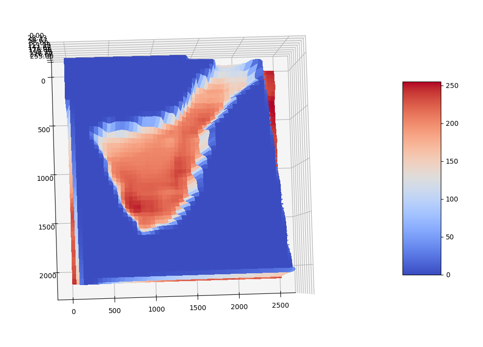

# Depth Estimation with DPT — Monocular 3D Reconstruction for Coastal, Lunar, and Panoramic Scenes
This repository contains a collection of advanced experiments in monocular depth estimation using DPT (Dense Prediction Transformers) across multiple domains:
- Coastal scenes captured from satellite and shoreline cameras
- High‑resolution lunar imagery
- 360° panoramic reconstructions generated from PTZ camera sweeps
The goal is to evaluate the generalization capabilities of transformer‑based 3D perception models in unconventional environments and to explore reconstruction pipelines that combine classical computer vision with state‑of‑the‑art deep learning.


## Demo

| Imagen original | Heatmap | Reconstrucción 3D |
|-----------------|---------|-------------------|
|  |  |  |


## Key Features
1. Depth Estimation on Coastal Scenes
- Processing of Sentinel‑II and coastal camera imagery
- Generation of depth maps and heatmaps
- Animated 3D reconstructions (GIF) for qualitative analysis
- Evaluation of model robustness under water reflections, horizon ambiguity, and atmospheric effects
2. Depth Estimation on Lunar Imagery
- Application of DPT models to high‑resolution Moon images
- Analysis of out‑of‑distribution behavior
- Optional comparison with known lunar topography
3. Sub‑project: 360° PTZ Panoramic Reconstruction
- Sequential capture using a PTZ camera
- Automatic stitching to generate a full 360° panorama
- Depth estimation across the entire panoramic field
- Optimized pipeline for large‑FOV scenes

## Model Architecture

The project leverages several DPT variants:
- DPT-Large
- DPT-Hybrid
- MiDaS v3.1 (baseline)
All models run on PyTorch and are integrated into a modular inference pipeline supporting:
- Configurable preprocessing
- Batch or streaming inference
- Post‑processing (normalization, colormap generation, spatial smoothing)
- Export of depth maps, meshes, and animated reconstructions


## Repository Structure

```
├── data/
│    *.png/
├── outputs/
│   ├── depth_maps/
│   ├── heatmaps/
│   └── reconstructions/
└── README.md
```

## Installation

git clone https://github.com/qwerteleven/satellite_image_segmentation.git
cd satellite_image_segmentation
pip install -r requirements.txt


## Generate a 3D mesh from a depth map

python src/reconstruction/depth_to_mesh.py --depth output/depth.png --mesh output/mesh.obj


## Results

The repository includes:
- Original images
- Depth maps
- Heatmaps
- Animated 3D reconstructions
These outputs enable evaluation of:
- Model robustness in out‑of‑distribution domains
- Common artifacts (banding, depth bleeding, horizon inconsistencies)
- Reconstruction quality in wide‑angle scenes


## Roadmap
- [ ] Integration with diffusion‑based depth models
- [ ] Multi‑view optimization for depth refinement
- [ ] WebGL viewer for interactive 3D visualization
- [ ] Lightweight domain‑specific fine‑tuning (LoRA)

## License
MIT License — see LICENSE.

## Contributions
Contributions are welcome.
Feel free to open an issue or submit a pull request with improvements, bug fixes, or new features.


## Data source
[sentinel - II](https://www.esa.int/ESA_Multimedia/Missions/Sentinel-2/)

