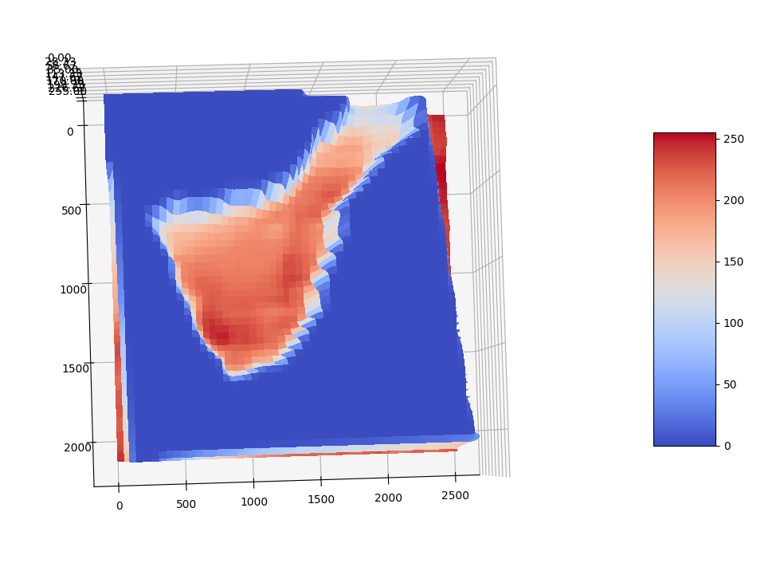

# 🛰️ Monocular Depth Estimation — Coastal, Lunar & Panoramic Scene Reconstruction

A research pipeline for [monocular depth estimation](https://en.wikipedia.org/wiki/Depth_perception#Monocular_cues) applied to unconventional domains: satellite coastal imagery, high-resolution lunar photography, and 360° PTZ panoramas. The system uses [Dense Prediction Transformer (DPT)](https://arxiv.org/abs/2103.13413) models to produce depth maps from single images, then reconstructs 3D surfaces and animated GIF walkthroughs from the results.

The core challenge is **out-of-distribution generalization**: DPT models are trained on everyday scenes; applying them to Sentinel-II satellite imagery, the lunar surface, or wide-FOV panoramas tests how far their learned priors hold up under domain shift.

---

## Demo

| Original image | Depth heatmap | 3D reconstruction |
|----------------|---------------|-------------------|
|  |  |  |

---

## Key technical challenges

**Water reflections and horizon ambiguity** — coastal scenes have no clear depth cue at the sea-sky boundary; reflections on water create inverted depth signals that confuse models trained on terrestrial scenes.

**Out-of-distribution lunar imagery** — the Moon has no atmosphere, no colour cues, and texture statistics radically different from Earth. The pipeline evaluates model behaviour in this extreme case, optionally comparing against known lunar topography.

**Large-image tiling** — DPT models have a fixed input resolution (512×512). Large satellite images are split into a grid of overlapping crops, each inferred independently, then reassembled. The seam between adjacent crops produces **depth discontinuities** that must be corrected.

---

## Architecture

### Depth estimation models

Three [transformer](https://en.wikipedia.org/wiki/Transformer_(deep_learning_architecture))-based depth models are supported via the Hugging Face `transformers` pipeline:

| Model | Notes |
|-------|-------|
| `Intel/dpt-large` | Highest quality, heaviest |
| `Intel/dpt-hybrid-midas` | Hybrid CNN+transformer backbone (default) |
| MiDaS v3.1 | Baseline for comparison |

All models produce **relative depth maps** — pixel values encode relative distance, not metric depth. Post-processing normalises these to the `[0, 255]` range for visualisation.

### Tiling pipeline — `depth_model.py`

Large images are tiled into a regular grid of 512×512 crops:

```python
x_slice_points = np.linspace(0, image.shape[0], x_splits, dtype=np.int16)
y_slice_points = np.linspace(0, image.shape[1], y_splits, dtype=np.int16)

crop_inputs = [
    image[x_slice_points[x]:x_slice_points[x+1],
          y_slice_points[y]:y_slice_points[y+1]]
    for x in range(...) for y in range(...)
]
```

Each crop is inferred independently, then stitched back into a full-resolution depth map via `union_results`. This lets the pipeline handle arbitrary-resolution input beyond the model's native 512×512 limit.

### Crop alignment — `aling_crops`

Since each crop is inferred independently, adjacent crops have **inconsistent depth scales** — the model has no global context. The alignment step corrects this by measuring the mean depth at shared borders and shifting each crop's values to match its neighbour:

```python
# Horizontal alignment: match rightmost column of crop A to leftmost column of crop B
a = results[crop_x_index]["depth"][:, -1]      # right edge of crop A
b = results[crop_x_index + 1]["depth"][:, 0]   # left edge of crop B

c = np.mean(a) - np.mean(b)  # offset to close the gap
b = b + c                     # shift crop B
```

The same correction is applied in both horizontal and vertical directions.

### Border blending — `lateral_proyection.py`

`border_adjust` implements a more sophisticated seam correction than simple mean-shifting. It builds a **pixel-level adjustment mask** that tapers toward zero as it moves away from the crop boundary — so the correction is strong at the seam and fades smoothly into the crop interior:

```python
meeting_point = (a[-1] + b[0]) / 2  # target value at the boundary

# Build a mask that weights pixels by proximity to the seam edge
# and by local depth variance (high-variance regions get less correction)
mask_a = ...  # tapered adjustment for crop A's right edge
mask_b = ...  # tapered adjustment for crop B's left edge
```

The mask is suppressed in regions of high depth variance (`maximum_pixel_change` threshold) to avoid over-correcting textured areas where depth genuinely changes rapidly.

### Multi-scale stacking — `depth_model_stack.py`

An iterative refinement strategy: inference is run at progressively finer resolutions (powers of 2, from coarse to fine). At each scale, the crop grid becomes denser, adding detail to the depth map without losing the global structure established at the coarsest scale.

```python
input_resolutions = [
    [2**l, 2**l]
    for l in range(8, int(math.log2(min(image.shape[:2]))))
][::-1]  # coarse → fine

for split_resolution in input_resolutions:
    # infer at this resolution, refine previous result
```

At the coarsest scale, a bilateral smoothing pass and row-wise mean subtraction remove large-scale banding artefacts before the finer passes add detail.

The `vertical_view` mode adds a binary sea/land segmentation at the coarsest scale, masking out the water surface from the depth estimate — useful for coastal scenes where water depth is undefined.

### 3D surface rendering — `display_3d_model.py`

The final depth map is rendered as a 3D surface using matplotlib's `plot_surface`. The depth image is used directly as the Z coordinate, with X and Y spanning the pixel grid:

```python
Z = depth_image  # pixel intensity → elevation
surf = ax.plot_surface(X, Y, Z, cmap=cm.coolwarm)
```

A Gaussian smoothing pass (`cv2.filter2D`) reduces high-frequency noise before rendering, and a per-row bias subtraction removes depth drift across scan lines.

### Segmentation support — `segmentation_model.py`

A parallel semantic segmentation pipeline using `nvidia/segformer-b0-finetuned-ade-512-512` applies the same tiling strategy to produce per-class masks (road, vegetation, water, sky, etc.) over large images. This can be used to condition depth estimation — for example, zeroing out water-class regions before 3D reconstruction.

---

## Pipeline overview

```
Input image (satellite / lunar / PTZ panorama)
        │
        ▼
  Tile into 512×512 crops
        │
        ▼
  DPT depth estimation (per crop)
        │
        ├── depth_model.py       → single-resolution, crop alignment
        └── depth_model_stack.py → multi-scale stacking + border blending
        │
        ▼
  Crop stitching (union_results)
        │
        ▼
  Border correction (lateral_proyection.border_adjust)
        │
        ▼
  Full-resolution depth map
        │
        ├── Heatmap visualisation (2d_interpolation.py)
        ├── 3D surface render     (display_3d_model.py)
        └── Animated GIF          (gif_creation.py)
```

---

## Installation

```bash
git clone https://github.com/qwerteleven/satellite_image_segmentation.git
cd satellite_image_segmentation
pip install -r requirements.txt
```

Key dependencies: `transformers`, `torch`, `opencv-python`, `Pillow`, `numpy`, `scipy`, `matplotlib`

---

## Usage

### Single-resolution depth map

```bash
python depth_model.py
```

Reads `img_2.tiff`, tiles it into a 4×4 grid of 512×512 crops, infers depth with `Intel/dpt-hybrid-midas`, aligns crop borders, and writes the stitched result to `results/dpt-hybrid-midas/`.

### Multi-scale depth stack

```bash
python depth_model_stack.py
```

Runs the same pipeline at progressively finer resolutions (powers of 2 up to the image's smaller dimension), applying border blending at each scale. Output goes to `results/dpt-hybrid-midas-stack/`.

### 3D surface viewer

```bash
python display_3d_model.py
```

Reads a depth map (by default `luna/7.png`) and renders an interactive 3D surface. Edit the `cv2.imread` path at the top of the file to visualise any depth map.

### Generate GIFs

```bash
python gif_creation.py
```

Assembles all `.jpg` files in the `gran_canaria/`, `tenerife/`, and `luna/` folders into animated GIFs, one per scene.

### Semantic segmentation

```bash
python segmentation_model.py
```

Runs SegFormer tiled segmentation on `img.tiff`, producing per-class masks in `results/segformer-b0-finetuned-ade-512-512/`.

---

## Output structure

```
results/
├── dpt-hybrid-midas/
│   ├── depth_0.png ... depth_N.png    # Per-crop depth maps
│   └── union_results_depth.png        # Stitched full-resolution result
├── dpt-hybrid-midas-stack/
│   ├── union_results_depth_[256,256].png
│   ├── union_results_depth_[512,512].png
│   └── union_results_depth_[1024,1024].png
└── segformer-b0-finetuned-ade-512-512/
    ├── union_results_sky.png
    ├── union_results_water.png
    └── ...
```

---

## Data sources

- **Coastal imagery**: [Sentinel-2](https://www.esa.int/ESA_Multimedia/Missions/Sentinel-2/) (ESA) — 10 m/pixel multispectral satellite imagery
- **Lunar imagery**: High-resolution Moon photographs (local dataset)
- **Panoramas**: PTZ camera sweeps stitched into equirectangular projections

---

## Roadmap

- [ ] Integration with diffusion-based depth models
- [ ] Multi-view depth refinement (MVS)
- [ ] WebGL viewer for interactive 3D exploration
- [ ] Lightweight domain-specific fine-tuning (LoRA) for coastal/lunar domains

---

## Key references

| Concept | Reference |
|---------|-----------|
| Monocular depth estimation | [Depth perception — Wikipedia](https://en.wikipedia.org/wiki/Depth_perception#Monocular_cues) |
| Dense Prediction Transformer (DPT) | [DPT paper — arXiv](https://arxiv.org/abs/2103.13413) |
| Vision Transformer | [Vision Transformer — Wikipedia](https://en.wikipedia.org/wiki/Vision_transformer) |
| Semantic segmentation | [Image segmentation — Wikipedia](https://en.wikipedia.org/wiki/Image_segmentation) |
| Out-of-distribution generalization | [Distribution shift — Wikipedia](https://en.wikipedia.org/wiki/Distributional_shift) |
| Sentinel-2 satellite | [Sentinel-2 — ESA](https://www.esa.int/ESA_Multimedia/Missions/Sentinel-2/) |
| PTZ camera | [Pan–tilt–zoom camera — Wikipedia](https://en.wikipedia.org/wiki/Pan%E2%80%93tilt%E2%80%93zoom_camera) |